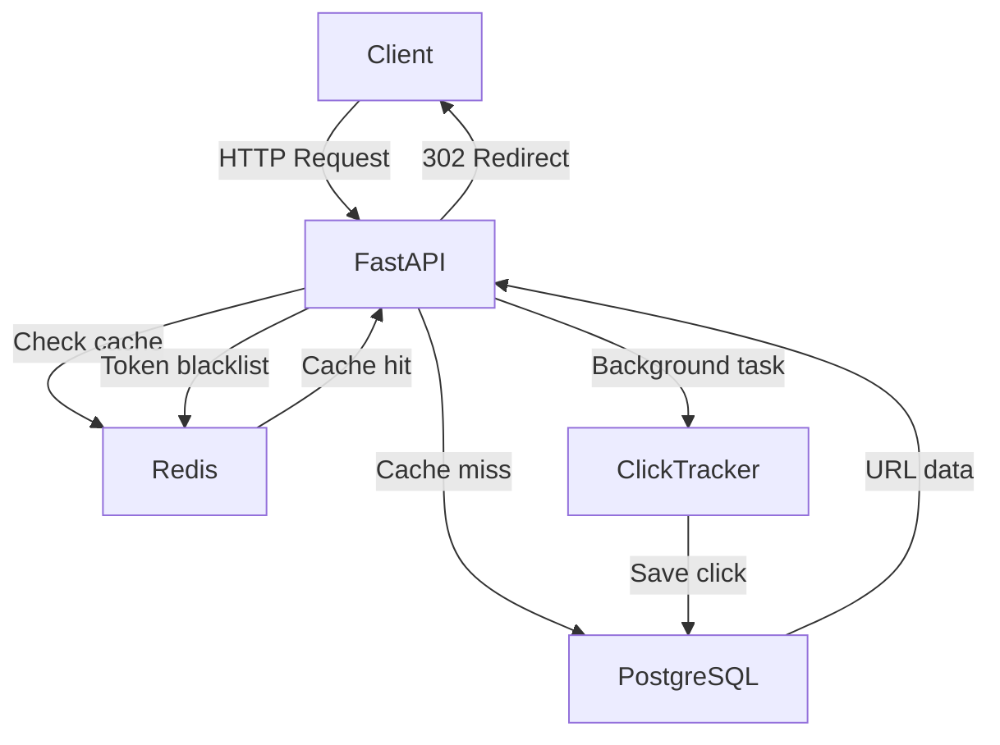
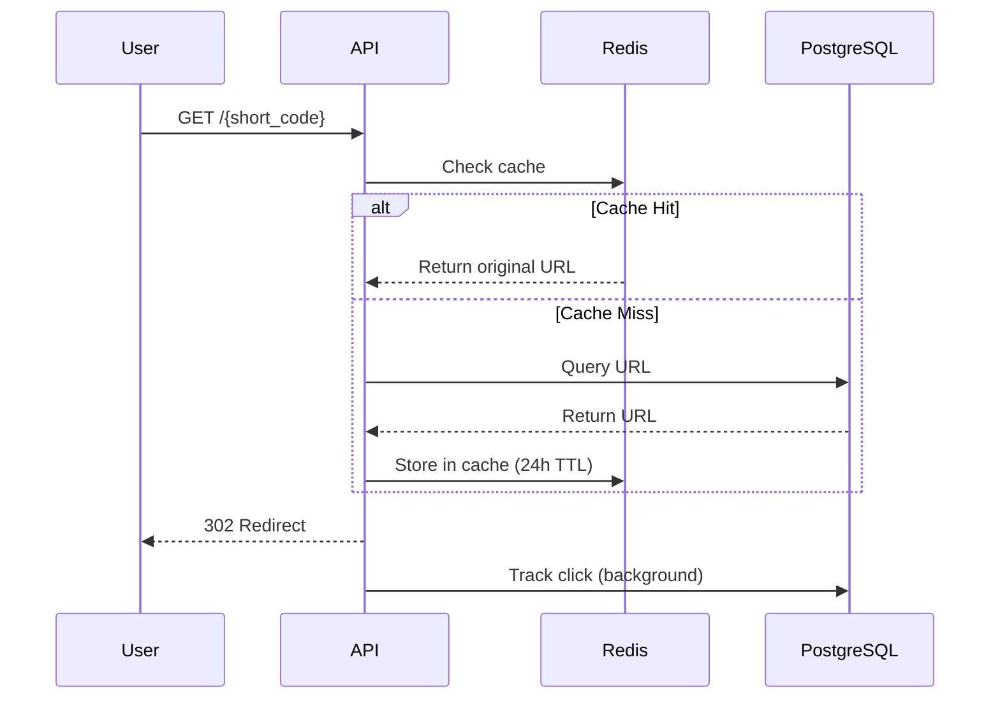

# URL Shortener with Analytics

A production-grade URL shortening service built with FastAPI, PostgreSQL, and Redis.
Live API: http://51.21.164.72:8000/docs

## Features

- JWT Authentication (register, login, refresh, logout)
- URL shortening with custom aliases and expiry
- Redis caching for fast redirects
- Async click tracking via background tasks
- Analytics — click summary, 7-day timeline, top referrers
- Collision-safe short code generation with retry logic
- Automatic cache fallback to PostgreSQL if Redis is unavailable
- Rate limiting per IP
- 18 automated tests

## Tech Stack

| Layer      | Technology              |
| ---------- | ----------------------- |
| Backend    | FastAPI (Python 3.11)   |
| Database   | PostgreSQL 16           |
| Cache      | Redis 7                 |
| Auth       | JWT (python-jose)       |
| ORM        | SQLAlchemy 2.0 (async)  |
| Migrations | Alembic                 |
| Testing    | pytest + pytest-asyncio |
| Container  | Docker + Docker Compose |
| Deploy     | AWS EC2 (Ubuntu 22.04)  |

## Architecture



## Redirect Flow



## API Endpoints

### Auth

| Method | Endpoint              | Description          |
| ------ | --------------------- | -------------------- |
| POST   | /api/v1/auth/register | Create account       |
| POST   | /api/v1/auth/login    | Login, get tokens    |
| POST   | /api/v1/auth/refresh  | Refresh access token |
| POST   | /api/v1/auth/logout   | Blacklist token      |

### URLs

| Method | Endpoint                  | Description          |
| ------ | ------------------------- | -------------------- |
| POST   | /api/v1/urls/shorten      | Create short URL     |
| GET    | /api/v1/urls              | List my URLs         |
| GET    | /{short_code}             | Redirect to original |
| DELETE | /api/v1/urls/{short_code} | Deactivate URL       |
| PATCH  | /api/v1/urls/{short_code} | Update alias/expiry  |

### Analytics

| Method | Endpoint                                 | Description    |
| ------ | ---------------------------------------- | -------------- |
| GET    | /api/v1/analytics/{short_code}/summary   | Click summary  |
| GET    | /api/v1/analytics/{short_code}/timeline  | Clicks per day |
| GET    | /api/v1/analytics/{short_code}/referrers | Top referrers  |

## Local Setup

### Prerequisites

- Python 3.11
- Docker Desktop

### Run locally

```bash
# Clone
git clone https://github.com/Sampatil06/url-shortener.git
cd url-shortener

# Create virtual environment
python -m venv venv
venv\Scripts\activate  # Windows
source venv/bin/activate  # Mac/Linux

# Install dependencies
pip install -r requirements.txt

# Start PostgreSQL and Redis
docker compose up db redis -d

# Run migrations
alembic upgrade head

# Start server
uvicorn app.main:app --reload
```

API docs: http://localhost:8000/docs

### Run with Docker

```bash
docker compose up --build
```

## Running Tests

```bash
pytest tests/ -v
```

18 tests covering auth, URL shortening, redirects, and analytics.

## Key Design Decisions

**Why Redis for caching?**
Redirect speed is critical. Redis serves cached URLs in <1ms vs 10-20ms for PostgreSQL queries.

**Why HTTP 302 not 301?**
301 is cached permanently by browsers. 302 ensures every redirect goes through our server so we can track clicks accurately.

**How are short code collisions handled?**
On each generation we check the DB for existence and retry up to 5 times with a new random code before failing.

**What happens if Redis goes down?**
The app falls back to PostgreSQL automatically — Redis is cache-only, not the source of truth.
