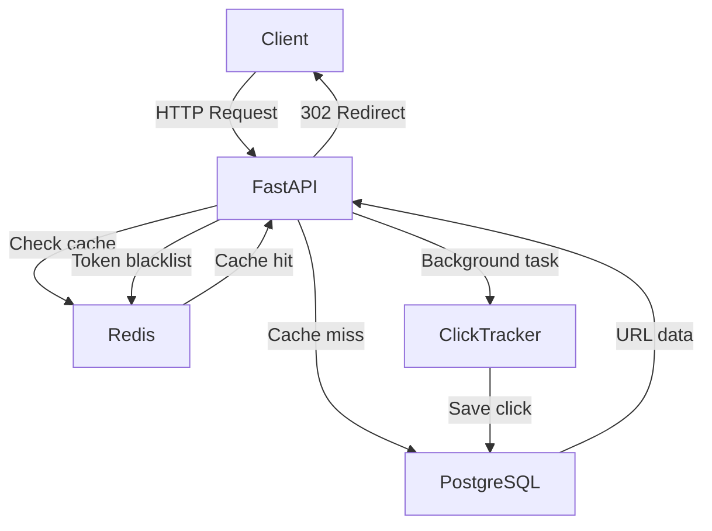

# LinkLens

A production-grade URL shortner built with FastAPI, PostgreSQL, and Redis.

 

## Features

- JWT Authentication (register, login, refresh, logout)
- URL shortening with custom aliases and expiry
- Redis caching for fast redirects
- Async click tracking via background tasks
- Analytics — click summary, 7-day timeline, top referrers
- Collision-safe short code generation with retry logic
- Automatic cache fallback to PostgreSQL if Redis is unavailable
- Rate limiting per IP
- 18 automated tests

 

## Architecture

 

## API Endpoints

### Auth

| Method | Endpoint              | Description          |
| ------ | --------------------- | -------------------- |
| POST   | /api/v1/auth/register | Create account       |
| POST   | /api/v1/auth/login    | Login, get tokens    |
| POST   | /api/v1/auth/refresh  | Refresh access token |
| POST   | /api/v1/auth/logout   | Blacklist token      |

### URLs

| Method | Endpoint                  | Description          |
| ------ | ------------------------- | -------------------- |
| POST   | /api/v1/urls/shorten      | Create short URL     |
| GET    | /api/v1/urls              | List my URLs         |
| GET    | /{short_code}             | Redirect to original |
| DELETE | /api/v1/urls/{short_code} | Deactivate URL       |
| PATCH  | /api/v1/urls/{short_code} | Update alias/expiry  |

### Analytics

| Method | Endpoint                                 | Description    |
| ------ | ---------------------------------------- | -------------- |
| GET    | /api/v1/analytics/{short_code}/summary   | Click summary  |
| GET    | /api/v1/analytics/{short_code}/timeline  | Clicks per day |
| GET    | /api/v1/analytics/{short_code}/referrers | Top referrers  |

 

## Tech Stack

| Layer      | Technology              |
| ---------- | ----------------------- |
| Backend    | FastAPI                 |
| Database   | PostgreSQL              |
| Cache      | Redis                   |
| Auth       | JWT                     |
| ORM        | SQLAlchemy              |
| Migrations | Alembic                 |
| Testing    | pytest + pytest-asyncio |
| Container  | Docker                  |
| Deploy     | AWS EC2                 |
